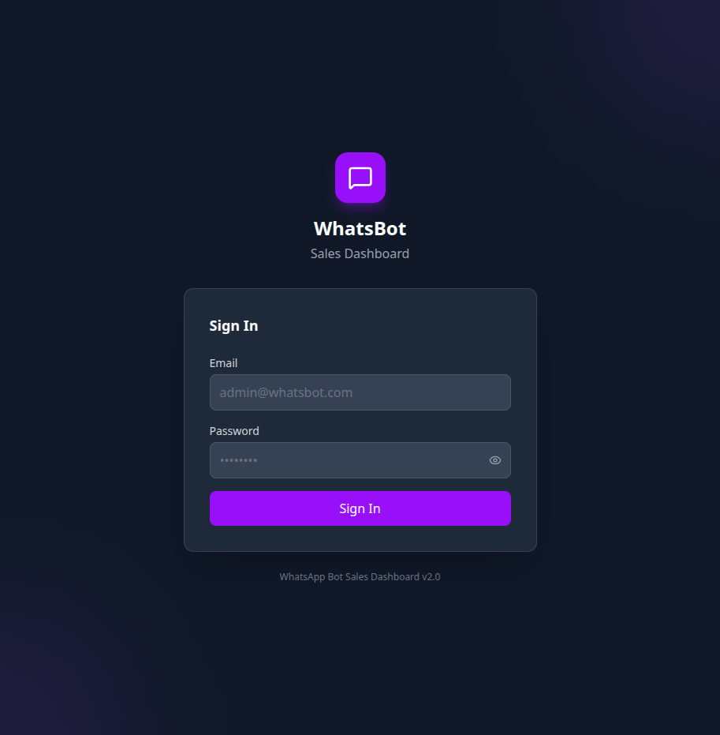
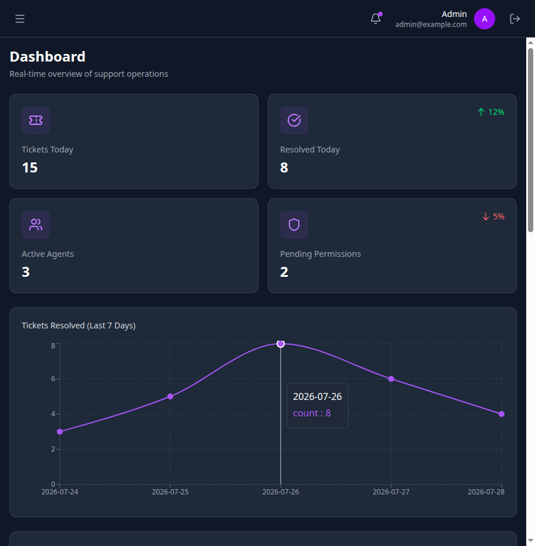
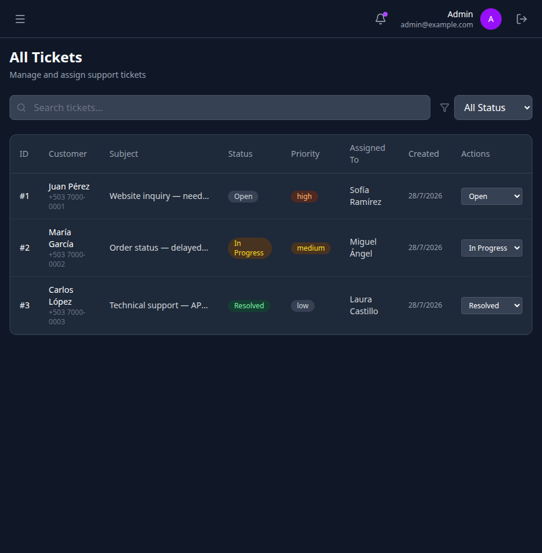
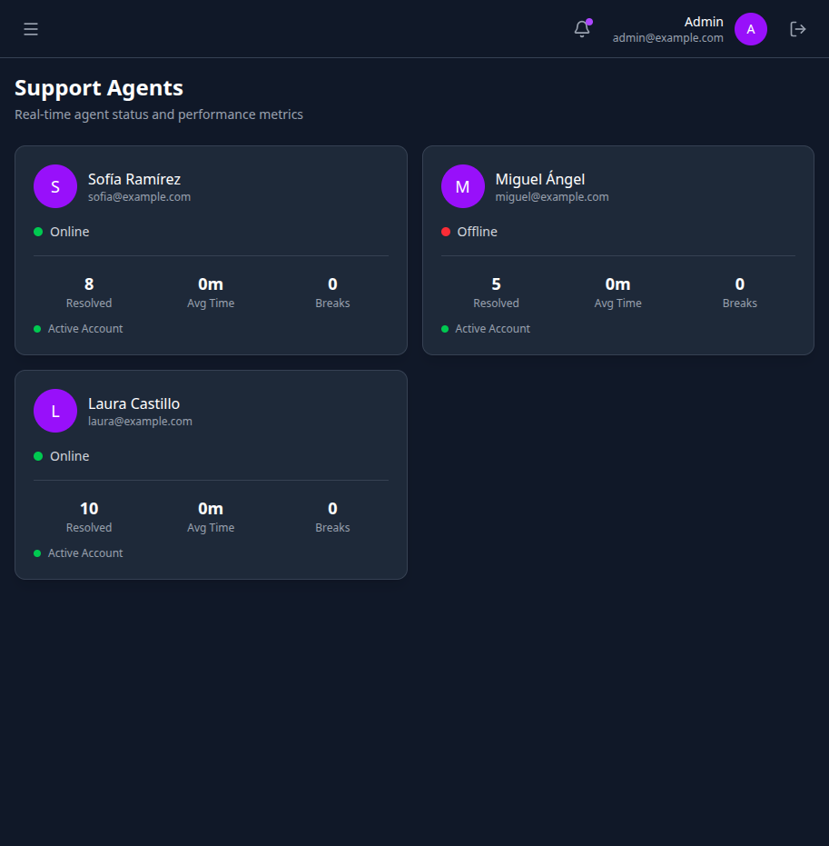
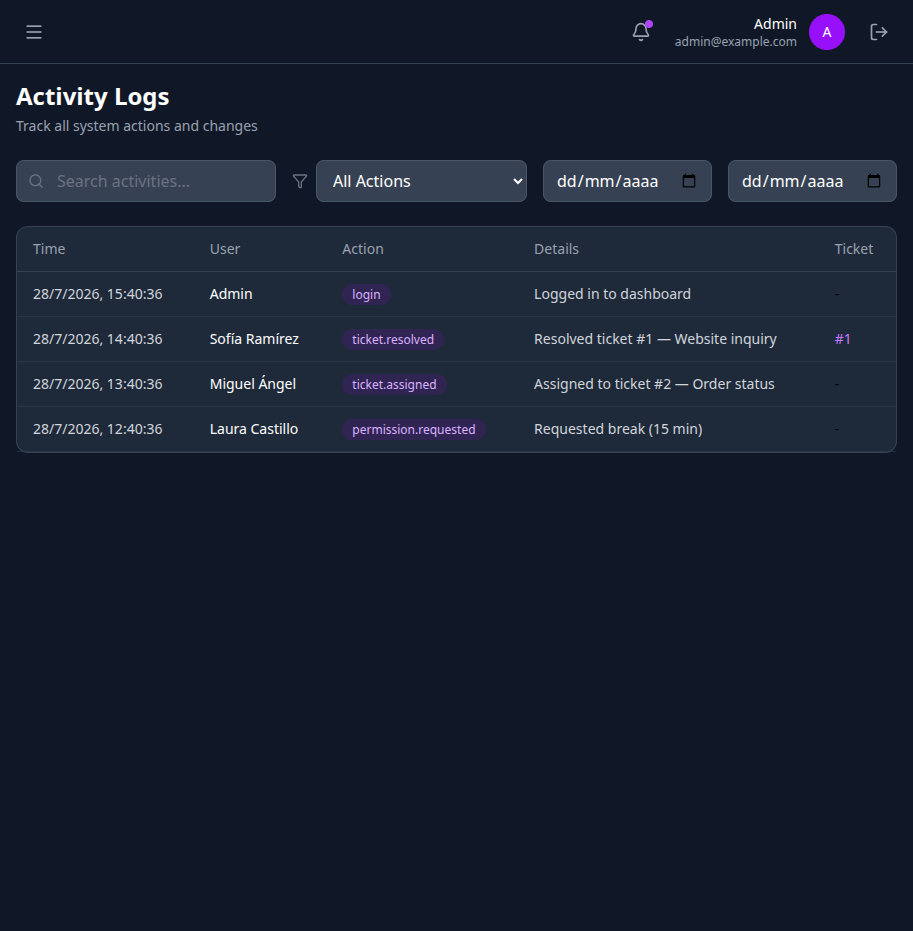
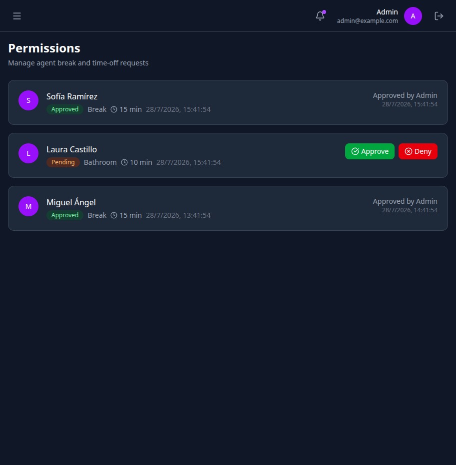
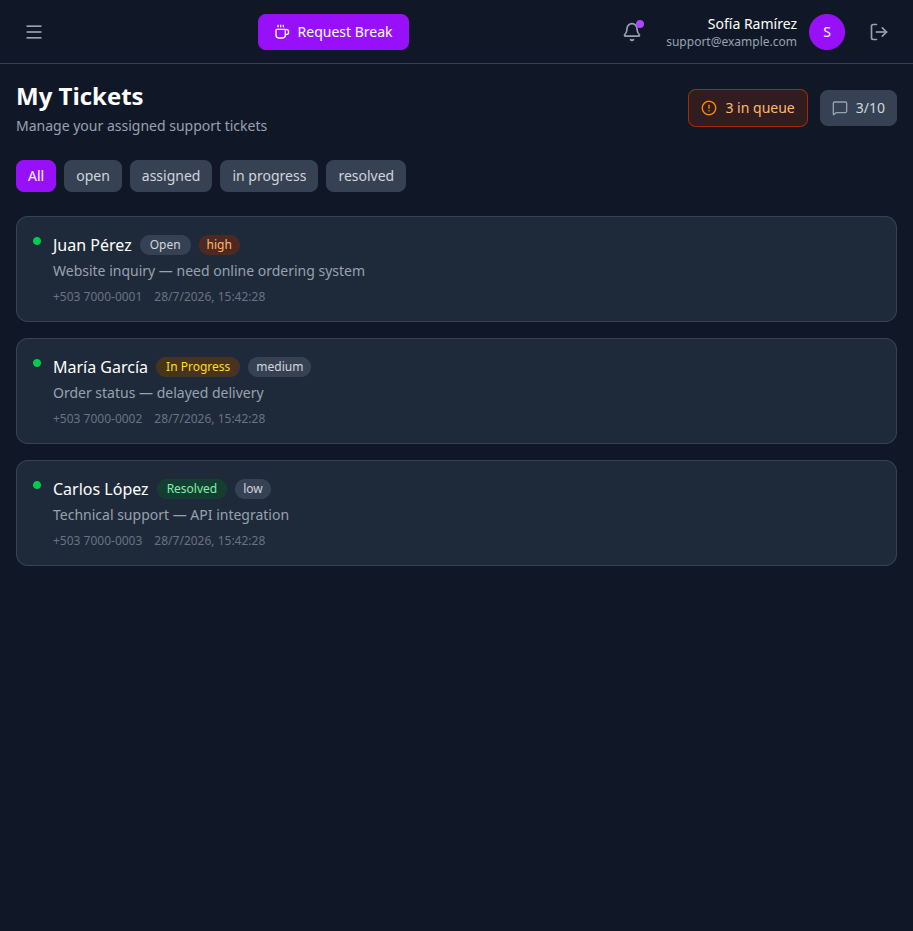
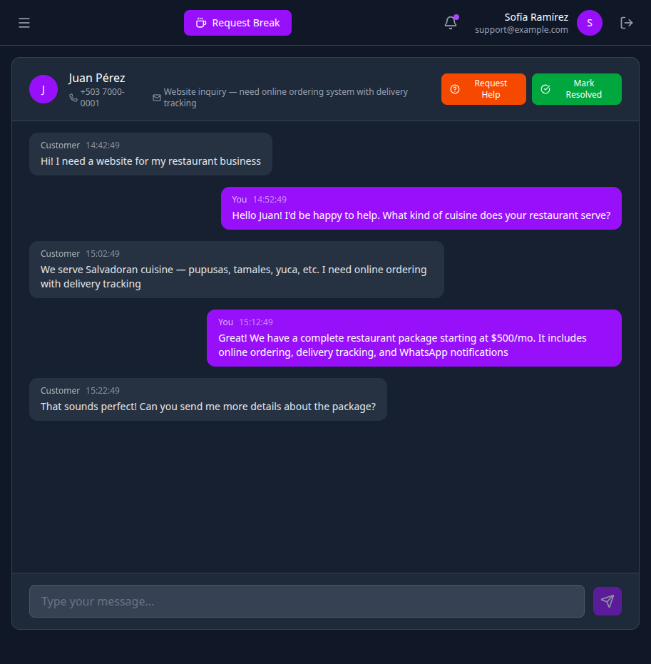

# WhatsApp Sales Bot — AI Support + Dashboard

An intelligent WhatsApp bot with an AI-powered sales and support agent, ticket management system, and a full-featured admin dashboard. Connects via the **WhatsApp Cloud API** (production-ready, webhook-based), with **WhatsApp Web (Baileys/QR)** available for local development only.

## Screenshots

<div align="center">
  <table>
    <tr>
      <td align="center"><strong>Login</strong></td>
      <td align="center"><strong>Admin Dashboard</strong></td>
    </tr>
    <tr>
      <td></td>
      <td></td>
    </tr>
    <tr>
      <td align="center"><strong>Tickets Management</strong></td>
      <td align="center"><strong>Support Agents</strong></td>
    </tr>
    <tr>
      <td></td>
      <td></td>
    </tr>
    <tr>
      <td align="center"><strong>Activity Logs</strong></td>
      <td align="center"><strong>Permissions Management</strong></td>
    </tr>
    <tr>
      <td></td>
      <td></td>
    </tr>
    <tr>
      <td align="center"><strong>Support Tickets</strong></td>
      <td align="center"><strong>Live Chat</strong></td>
    </tr>
    <tr>
      <td></td>
      <td></td>
    </tr>
  </table>
</div>

## Features

- **AI-powered sales/support agent** (Hugging Face)
- **WhatsApp Cloud API connection** (production-ready, webhook-based)
- **WhatsApp Web connection** (QR code pairing via Baileys — local development only)
- **Ticket system** with human support escalation
- **Admin dashboard** with real-time metrics
- **Support agent panel** with chat interface
- **Analytics and activity tracking**
- **Permission management** with break tracking
- **Queue system** (Bull) for async processing
- **Docker** for local development (docker-compose)
- **Render-ready** (deploy via Render's native Node runtime)

## Tech Stack

- **Node.js** + **TypeScript**
- **Express.js**
- **Sequelize** + **SQLite** (relational database)
- **Redis** (cache and queues)
- **Bull** (queue system)
- **Hugging Face API** (AI agent)
- **pnpm** (package manager)
- **Docker**
- **React** + **Vite** + **Tailwind CSS** (dashboard frontend)
- **WhatsApp Cloud API** (primary production connection)
- **WhatsApp Web** (Baileys — local development only)

## Prerequisites

- Node.js 22 (LTS)
- pnpm 9+
- Docker (optional, for local development only)
- (Optional, local development only) WhatsApp account (for QR code pairing via WhatsApp Web)
- (Optional) Hugging Face token for advanced AI
- WhatsApp Business API account with `WHATSAPP_TOKEN` and `WHATSAPP_PHONE_NUMBER_ID` (required for production — Cloud API is the primary channel)

## Project Structure

```
whatsapp-bot-demo/
├── src/
│   ├── config/           # Configuration (DB, Redis, Queues)
│   ├── controllers/      # HTTP controllers
│   ├── models/           # Database models
│   ├── routes/           # Express routes
│   ├── services/         # Business logic
│   │   ├── ai.service.ts           # AI service (Hugging Face)
│   │   ├── bot.service.ts          # Core bot logic
│   │   ├── whatsapp.service.ts     # WhatsApp messaging (Cloud API + Web)
│   │   └── whatsapp-web.service.ts # WhatsApp Web connection (Baileys)
│   ├── app.ts
│   └── server.ts
├── dashboard/            # React frontend (Vite + Tailwind CSS)
│   ├── src/
│   │   ├── pages/        # Dashboard pages
│   │   ├── contexts/     # Auth & Socket contexts
│   │   └── components/   # Reusable UI components
│   └── ...
├── data/                 # SQLite database (generated)
├── auth_info/            # WhatsApp Web auth state (generated)
├── screenshots/          # Application screenshots
├── docker-compose.yml
├── Dockerfile
├── render.yaml           # Render blueprint (native Node runtime)
├── .env.example
└── package.json
```

## Quick Start

### 1. Clone the repository

```bash
git clone <repo-url>
cd whatsapp-bot-demo
```

### 2. Install dependencies

```bash
pnpm install
```

### 3. Configure environment variables

```bash
cp .env.example .env
```

Edit `.env` with your credentials. At minimum, set a `JWT_SECRET` for dashboard authentication; when running with `NODE_ENV=production` you must also set `ADMIN_EMAIL` and `ADMIN_PASSWORD` — the app fails fast (exits on boot) without them.

### 4. Build and run

```bash
# Build TypeScript
pnpm run build

# Start the server
pnpm start
```

The API server will start on port `3000` by default.

### 5. Start the dashboard (development mode)

```bash
cd dashboard
pnpm install
pnpm dev
```

The dashboard frontend will start on port `5173` (Vite dev server).

## Docker (Local Development Only)

> Docker is **not** the production path. Deployments on Render use the
> native Node.js runtime — see [Deploy to Render](#deploy-to-render) below.
> The Docker setup below is for local development and testing only.

### Build and run with Docker

```bash
docker build -t whatsapp-bot .
docker run -p 3000:3000 --env-file .env whatsapp-bot
```

### Docker Compose

```bash
docker compose up -d --build
```

### View logs

```bash
docker compose logs -f app
```

### Stop

```bash
docker compose down
```

### Stop and remove volumes

```bash
docker compose down -v
```

## Deploy to Render

The official production path is Render's **native Node.js runtime** via the `render.yaml` Blueprint — no Docker image. Render builds with pnpm and starts the compiled app with `pnpm start`; the health check hits `/health`.

### One-click deploy (Blueprint)

1. Push this repository to GitHub
2. In the Render Dashboard, click **New +** → **Blueprint**
3. Connect your repository — the `render.yaml` in the repo root is picked up automatically
4. After the first Blueprint sync, set the required secrets in **Service → Environment** (see below)
5. Deploy — Render builds with `pnpm install --frozen-lockfile && pnpm run build` and starts with `pnpm start`

Alternatively, create a **Web Service** manually:
- **Runtime**: Node
- **Build Command**: `pnpm install --frozen-lockfile && pnpm run build`
- **Start Command**: `pnpm start`
- **Health Check Path**: `/health`

### Environment variables in Render

The entries marked `sync: false` in `render.yaml` are **not** tracked in git — set their values in the Render dashboard (Service → Environment):

| Variable | Required? | Notes |
|---|---|---|
| `JWT_SECRET` | **Required** | Dashboard auth — use a long, random value |
| `WHATSAPP_TOKEN` | **Required** | WhatsApp Cloud API token |
| `WHATSAPP_PHONE_NUMBER_ID` | **Required** | WhatsApp Cloud API phone number ID |
| `WEBHOOK_VERIFY_TOKEN` | **Required** | Webhook verification token |
| `ADMIN_EMAIL` | **Required** | Initial admin email (SEC-002) — the app crashes on boot without it in production |
| `ADMIN_PASSWORD` | **Required** | Initial admin password (SEC-002) — use a strong, unique value |
| `REDIS_URL` / `REDIS_HOST` / `REDIS_PORT` | Optional | Redis for Bull queues — the app fails fast without it (free tier has no Redis) |
| `HUGGING_FACE_TOKEN` | Optional | AI agent works without it |
| `DASHBOARD_ORIGIN` | Optional | CORS origin (the dashboard is not deployed on Render) |
| `DB_STORAGE` | Optional | SQLite path (defaults to `./data/database.sqlite` — already set in `render.yaml`) |

> **Ephemeral disk on the free tier**: Render's free instances use an ephemeral filesystem that is **reset on every redeploy**. `data/database.sqlite` (SQLite database) is wiped on each deploy — plan to re-seed data after every deploy, or use a persistent disk / external database on a paid plan. (`auth_info/`, the WhatsApp Web session, is only used in local development — the Cloud API webhook requires no pairing.)

> **Redis**: Render's free tier does not support Redis. The queue system (Bull) is optional — the app starts without it (fail-fast). If you need queues in production, add a managed Redis provider or upgrade the plan.

## WhatsApp Cloud API (Primary Method)

The bot connects to WhatsApp through the **WhatsApp Cloud API** (Meta), which is the **primary connection method in production**. It receives and sends messages via webhooks using `WHATSAPP_TOKEN`, `WHATSAPP_PHONE_NUMBER_ID`, and `WEBHOOK_VERIFY_TOKEN` — no QR pairing or phone session required, and it works headless on Render.

1. **Set the Cloud API environment variables** — `WHATSAPP_TOKEN`, `WHATSAPP_PHONE_NUMBER_ID`, and `WEBHOOK_VERIFY_TOKEN` (see the [Render env vars table](#environment-variables-in-render) or [Environment Variables](#environment-variables)).
2. **Configure the webhook** — point your Meta webhook to `https://<your-app>/whatsapp/webhook` and verify it with `WEBHOOK_VERIFY_TOKEN` (the app handles the `hub.mode`/`hub.verify_token` challenge).
3. **The bot is ready** — messages are delivered through the Cloud API; no QR scan or session management needed.

> **Note**: In production, serve the webhook over HTTPS (see [Security](#security)).

### WhatsApp Web (Baileys — Local Development Only)

For local development, the bot can also connect via **Baileys** (WhatsApp Web protocol) using QR code pairing. This is **not** the production channel and does not work on Render's headless instances.

1. **Start the application** — on first run, a QR code will be printed in the terminal:

```bash
pnpm start
```

2. **Scan the QR code** with your phone:
   - Open WhatsApp on your phone
   - Tap the **three dots** menu (Android) or **Settings** (iOS)
   - Go to **Linked Devices** → **Link a Device**
   - Scan the QR code displayed in the terminal

3. **Automatic reconnection** — the bot saves authentication state in the `auth_info/` directory and will reconnect automatically on restart. If the session expires or logs out, delete the `auth_info/` folder and restart.

## Dashboard

The admin dashboard is available at `http://localhost:3000/dashboard` (or your configured port).

### Dashboard Setup

1. **Set `JWT_SECRET`** in your `.env` file — this secures dashboard authentication.
2. **Set `DASHBOARD_ORIGIN`** to match your frontend URL (default: `http://localhost:5173` for Vite dev server).
3. **Start the app** and navigate to the dashboard URL.
4. **Login** with your admin credentials — set `ADMIN_EMAIL` / `ADMIN_PASSWORD` in production; the default `admin@example.com` / `admin123` is development-only.

> **Note:** When running the dashboard frontend separately (e.g., Vite dev server on port 5173), ensure `DASHBOARD_ORIGIN` matches the frontend origin to allow CORS.

## Bot Commands

- **MENU** — View main menu
- **HELP** — View help and available commands
- **HOURS** — View business hours

## Environment Variables

| Variable | Description | Default |
|---|---|---|
| `PORT` | Server port | `3000` |
| `NODE_ENV` | Environment mode | `development` |
| `DB_STORAGE` | SQLite database file path | `./data/database.sqlite` |
| `REDIS_URL` | Redis connection string | `redis://localhost:6379` |
| `REDIS_HOST` | Redis host | `localhost` |
| `REDIS_PORT` | Redis port | `6379` |
| `REDIS_PASSWORD` | Redis password (optional) | — |
| `WHATSAPP_TOKEN` | WhatsApp Cloud API token | — |
| `WHATSAPP_PHONE_NUMBER_ID` | WhatsApp phone number ID | — |
| `WEBHOOK_VERIFY_TOKEN` | Webhook verification token | — |
| `JWT_SECRET` | JWT secret for dashboard auth | — |
| `ADMIN_EMAIL` | Initial admin email — **REQUIRED in production** | — |
| `ADMIN_PASSWORD` | Initial admin password — **REQUIRED in production** | — |
| `HUGGING_FACE_TOKEN` | Hugging Face API token (optional) | — |
| `DASHBOARD_ORIGIN` | Dashboard frontend origin for CORS | `http://localhost:5173` |

> **E2E testing**: the local E2E stack (`scripts/run-e2e.sh`) defaults to
> `ADMIN_EMAIL=admin@example.com` / `ADMIN_PASSWORD=admin123` (set by the
> script; override via env if needed). In production (Render) always use the
> real `ADMIN_EMAIL` / `ADMIN_PASSWORD` secrets.

## Security

- Never commit your `.env` files or `.env` content
- Use a strong, unique `JWT_SECRET` in production
- Set `ADMIN_EMAIL` and `ADMIN_PASSWORD` in production — the `admin@example.com` / `admin123` default is development-only (SEC-002)
- Configure HTTPS for the webhook (Cloud API mode)
- Validate all user input
- The `auth_info/` directory contains your WhatsApp session credentials — treat it as sensitive data and add it to `.gitignore`
- API endpoints are protected with JWT-based authentication

## License

See the LICENSE file.

---

Built with automation to streamline sales and support
